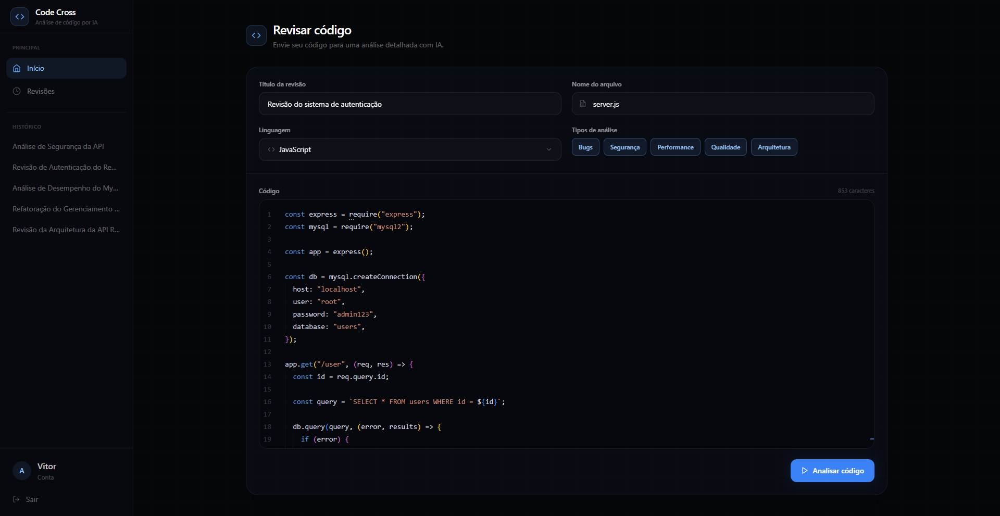
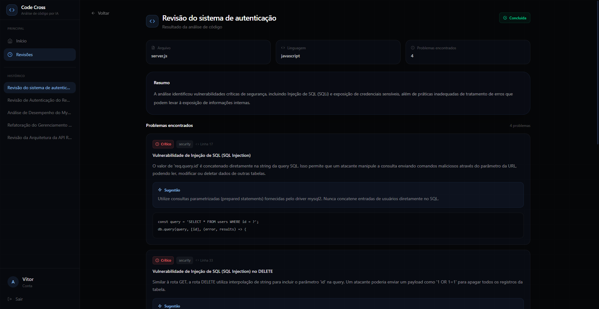

# Code Cross

Code Cross é um aplicativo de análise de código por IA. O Code Cross recebe um trecho de código, envia para um modelo de IA analisar e devolve um relatório estruturado com bugs, falhas de segurança, problemas de performance, qualidade e arquitetura — cada um com explicação, sugestão de correção e, quando possível, o código já corrigido.



## Funcionalidades

- **Cadastro e login** com autenticação via JWT armazenado em cookie httpOnly
- **Envio de código para análise**, com título, nome do arquivo, linguagem e escolha dos tipos de análise (Bugs, Segurança, Performance, Qualidade, Arquitetura)
- **Análise via IA** que retorna um resumo geral e uma lista de problemas encontrados, cada um com:
  - Severidade (crítico, alto, médio, baixo, sugestão)
  - Categoria (bug, segurança, performance, qualidade, arquitetura)
  - Linhas exatas do problema no arquivo
  - Explicação do porquê o código é problemático
  - Sugestão de correção e, quando aplicável, o código corrigido
- **Histórico de revisões** por usuário, com status (pendente, processando, concluída, falhou)
- **Editor de código integrado** (Monaco, o mesmo editor do VS Code) com destaque de sintaxe
- Respostas da IA sempre em português, mantendo código e identificadores técnicos no idioma original



## Tecnologias

**Frontend**

- React 19 + TypeScript + Vite
- Tailwind CSS
- React Router
- Monaco Editor (`@monaco-editor/react`)
- Chart.js (`react-chartjs-2`)
- Axios

**Backend**

- Node.js + Express 5
- MySQL (`mysql2`)
- Autenticação com JWT (`jsonwebtoken`) + `bcrypt` para senhas
- Integração com IA via SDK da OpenAI (`openai`) e SDK do Gemini (`@google/genai`)
- Segurança: `helmet`, `cors` com origem restrita, `cookie-parser`, verificação de origem em requisições de escrita e rate limiting em login/cadastro
- Testes com Jest + Supertest

## Estrutura do projeto

```
codecross/
├── client/
│   └── src/
│       ├── api/
│       ├── components/
│       ├── contexts/
│       ├── layouts/
│       ├── pages/
│       ├── routes/
│       └── services/
├── server/
│   └── src/
│       ├── controllers/
│       ├── middleware/
│       ├── routes/
│       ├── services/
│       ├── tests/
│       └── utils/
└── schema.sql
```

## Como rodar localmente

### Pré-requisitos

- Node.js 18 ou superior
- MySQL

### 1. Banco de dados

Crie o banco executando o script disponível na raiz do projeto:

```bash
mysql -u root -p < schema.sql
```

### 2. Backend

```bash
cd server
npm install
cp env.example .env
```

Preencha o `.env` com:

```
SECRET_KEY=       # chave usada para assinar os tokens JWT
OPENAI_API_KEY=   # chave de API do OpenAI
FRONTEND_URL=     # URL do frontend, ex: http://localhost:5173
NODE_ENV=
DB_HOST=
DB_USER=
DB_PASSWORD=
DB_NAME=
```

Inicie o servidor:

```bash
npm run dev
```

### 3. Frontend

```bash
cd client
npm install
cp .env.example .env
```

No `.env`, defina a URL da API:

```
VITE_API_URL=http://localhost:8080
```

Inicie o frontend:

```bash
npm run dev
```

## Testes

O backend possui testes automatizados com Jest cobrindo autenticação, usuário e o fluxo de revisões:

```bash
cd server
npm test
```

## Licença

Este projeto foi desenvolvido como um projeto pessoal para portfólio.
